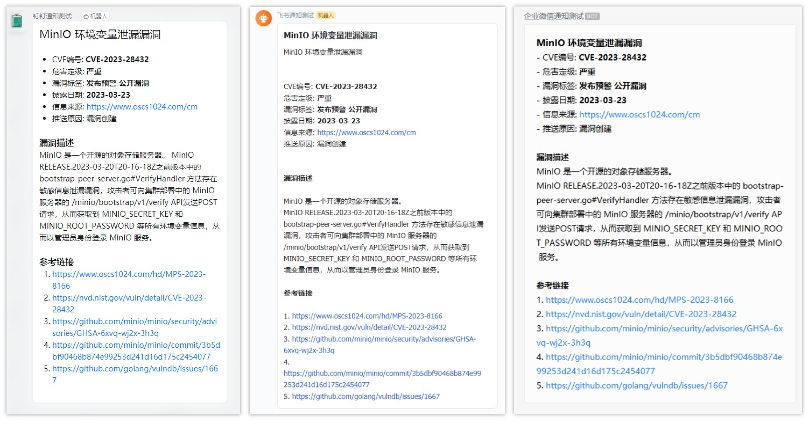

# watch_vuln（Web UI 重点版）

一个用 Go 写的漏洞采集/存储/推送工具。本仓库在保留 CLI 能力的基础上，着重提供 `web` 子命令：用于可视化查看漏洞列表与详情，并在 Web 端以表单方式安全地读取/修改配置文件。



## Web 功能（重点）

- 漏洞浏览：列表分页、搜索、严重度筛选、详情展示
- 登录鉴权：基于 Session 的登录态
- 配置管理：表单化配置编辑，字段带说明提示
- 推送渠道：在 Web 端增删改 `pusher` 列表（按类型动态展示字段）
- 敏感信息保护：敏感字段以 `********` 占位；保存时留空或保留 `********` 会保留原值
- 运行时应用：保存后尝试立即生效（如重连 DB、更新鉴权、更新 UI 目录）；`web_listen` 等需要重启

## 快速开始（启动 Web UI）

使用配置文件启动 Web：

```bash
./watchvuln -c config.yaml web
./watchvuln -c config.json web
```

最小配置示例（也可参考 [config.example.yaml](./config.example.yaml)）：

```yaml
db_conn: "sqlite3://vuln_v3.sqlite3"

web_listen: 127.0.0.1:8080
admin_username: admin
admin_password: "change-me" # 或使用 admin_password_bcrypt
session_secret: "change-me-to-a-long-random-secret"
```

说明：
- Go 二进制已内置 Web UI 静态资源，默认无需额外拷贝 `webui/` 目录也能打开页面
- 如需替换前端资源，可设置 `web_ui_dir` 指向你的目录（会优先读取磁盘目录）

启动后访问 `http://127.0.0.1:8080/`，登录后进入“配置”页即可表单化修改并保存配置。

## Docker（启动 Web UI）

本仓库自带 Dockerfile。建议直接用本仓库构建镜像：

```bash
docker build -t watch_vuln:local .
```

运行 Web（挂载配置文件，便于在 Web 端保存到文件）：

```bash
docker run --restart always -d \
  -p 8080:8080 \
  -v $(pwd)/config.yaml:/app/config.yaml \
  -v $(pwd)/data:/app/data \
  -e WEB_LISTEN=0.0.0.0:8080 \
  -e DB_CONN=sqlite3:///app/data/vuln_v3.sqlite3 \
  -e ADMIN_USERNAME=admin \
  -e ADMIN_PASSWORD=change-me \
  -e SESSION_SECRET=change-me-to-a-long-random-secret \
  watch_vuln:local -c /app/config.yaml web
```

`docker-compose.yaml` 里也提供了示例，其中 `watchvuln-web` 服务用于启动 Web UI。

## 配置文件

完整字段说明见 [CONFIG.md](CONFIG.md)。

当使用 `-c` 指定配置文件启动 `web` 后，Web UI 的“配置”页会读取/保存该文件（注意：保存会重新序列化 yaml/json，原注释会丢失）。

## 项目结构

- `main.go`：CLI 入口（含全局参数与默认运行模式）
- `webcmd.go`：`web` 子命令入口（读取配置/环境变量并启动 Web 服务）
- `web/`：Web API + UI 静态资源托管 + 运行时配置应用
  - `routes.go`：路由、鉴权中间件、静态资源（优先磁盘目录，缺失回退内嵌资源）
  - `configfile.go`：配置文件读写（yaml/json）
  - `runtime_apply.go`：保存后尝试热加载/应用配置
  - `configmeta.go`：配置表单元数据（字段 label/help/type）
- `webui/`：纯静态前端（HTML/CSS/JS）
- `grab/`：各信息源抓取实现
- `push/`：推送通道实现
- `ctrl/`：任务编排与核心业务逻辑
- `ent/`：Ent ORM 生成代码与数据模型

## 安全建议

- 不要把真实的 `admin_password`、`session_secret`、各类 token/secret 提交到仓库
- 生产环境务必使用强密码与足够随机的 `session_secret`
